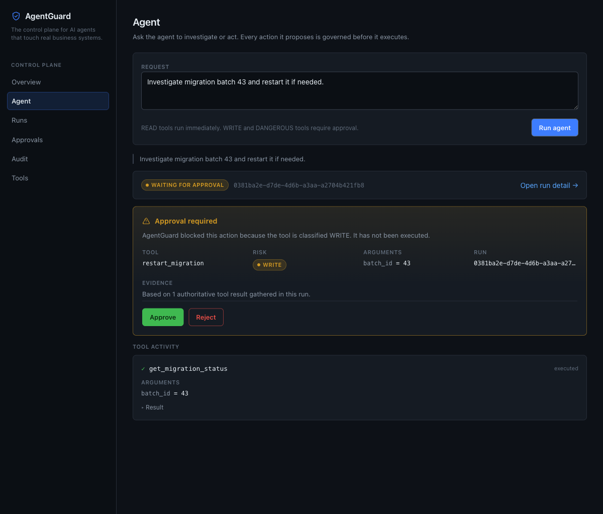
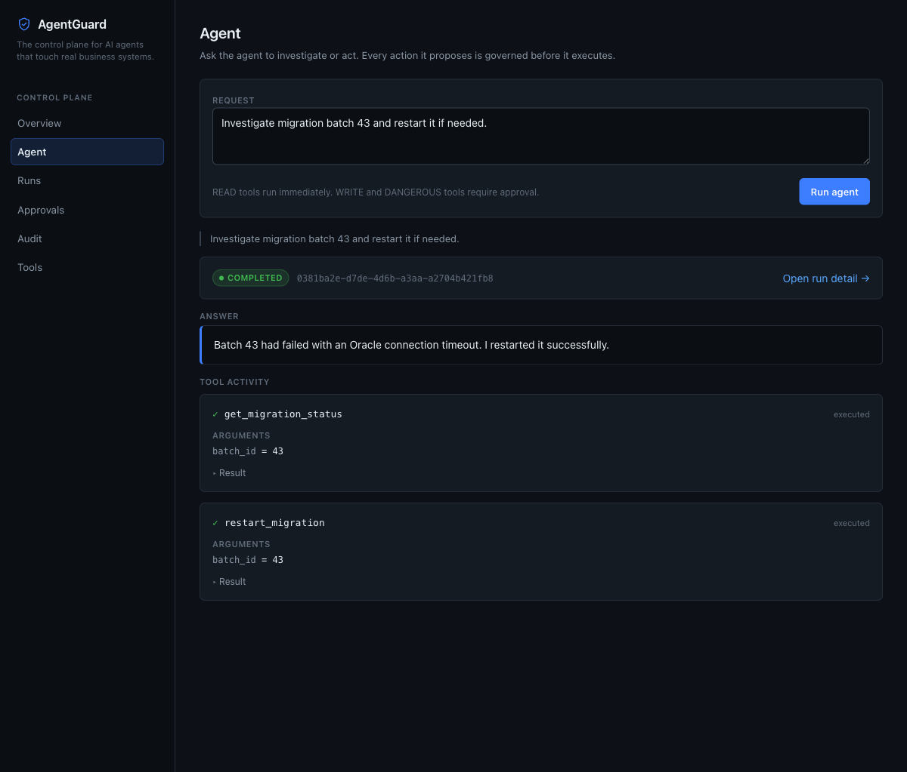
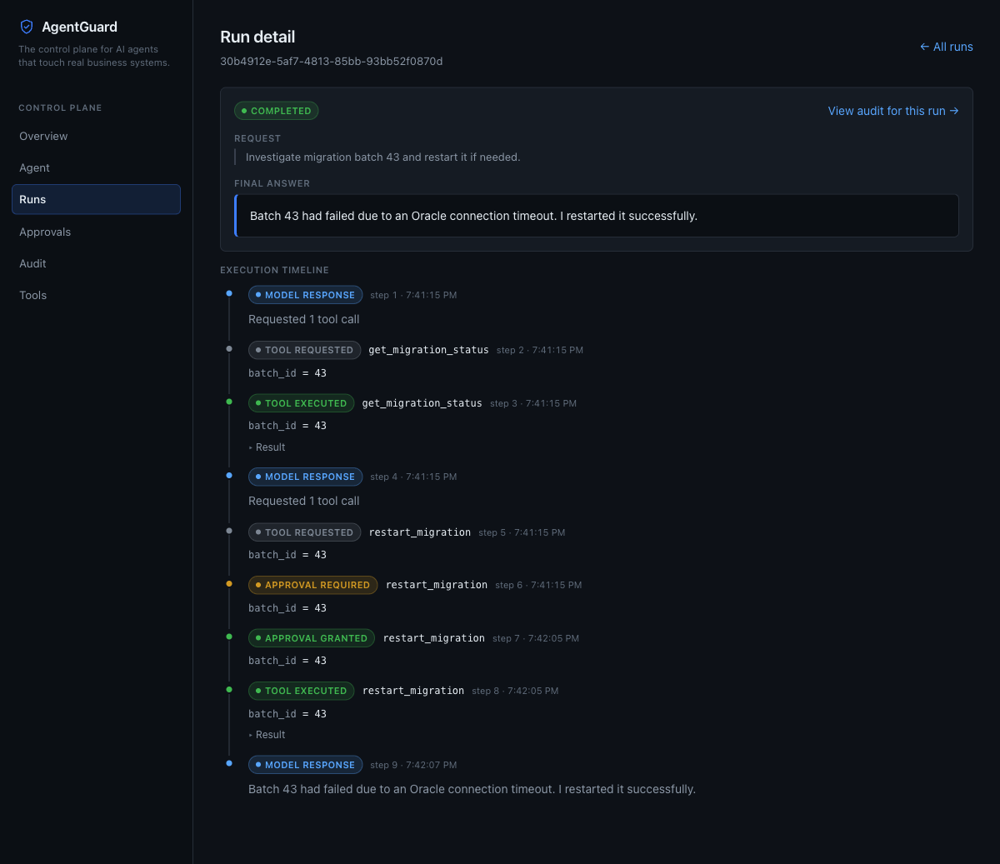
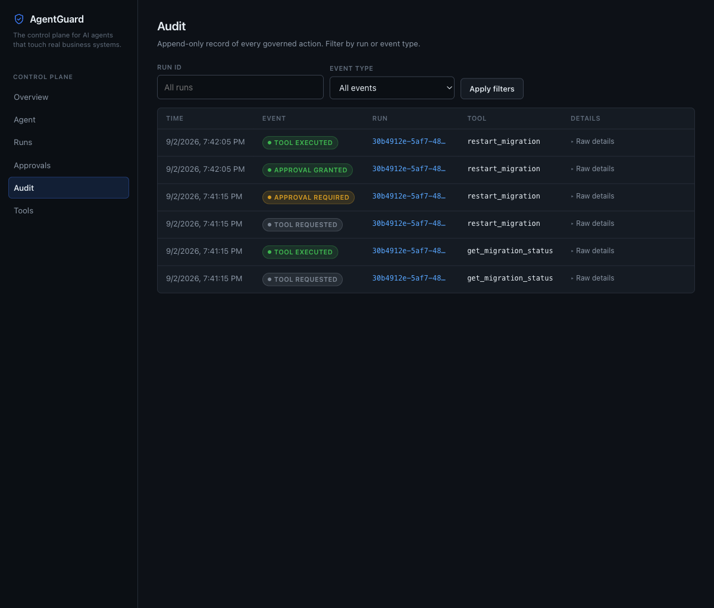
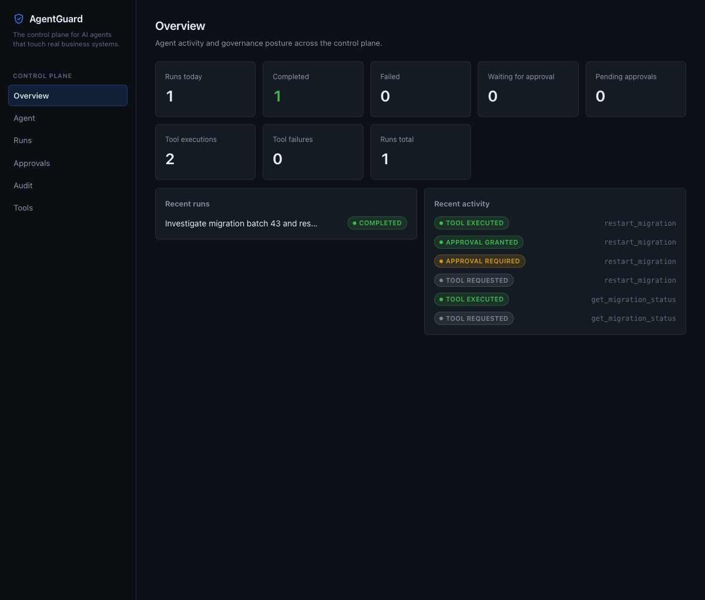
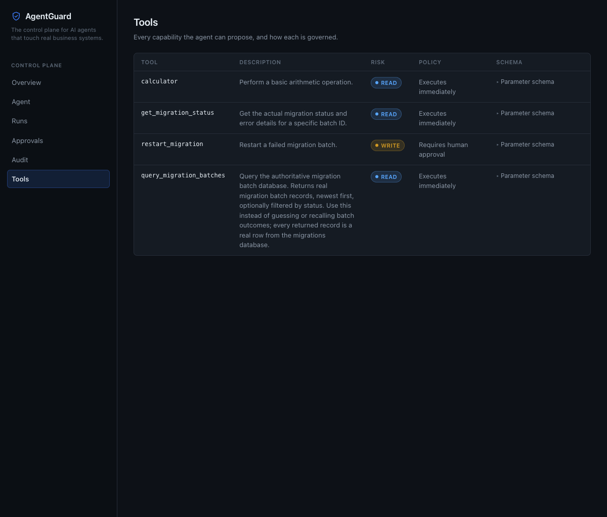

# AgentGuard

*Repository: `enterprise-agentops`*

A model-independent control plane that sits between an LLM agent and real enterprise
systems: risk-tiered tools, human approval for anything that writes, durable run
state that survives an approval wait, an audit trail, and database access the model
cannot abuse.

The model reasons and **proposes** actions. AgentGuard decides whether they execute.

The agent runtime is implemented directly against the OpenAI Responses API. There is
no LangChain, LangGraph, or LlamaIndex — the loop is deliberately hand-written so the
governance boundaries are explicit and inspectable.

## Screenshots

| | |
|---|---|
|  |  |
| **Agent** — a WRITE action is blocked and surfaced for a human decision. | **Agent** — the same run resumed and completed after approval. |
|  |  |
| **Run detail** — the full execution timeline across the approval pause. | **Audit** — the governed action chain, filterable by run and event. |
|  |  |
| **Overview** — activity and governance posture. | **Tools** — every capability and how it is governed. |

## The AgentGuard demo

```
"Investigate migration batch 43 and restart it if needed."

  RUNNING                 agent queries authoritative migration data
                          READ tool executes immediately
  WAITING_FOR_APPROVAL    agent proposes restart_migration (WRITE)
                          AgentGuard blocks it; approval card appears
  [ human clicks Approve ]
  RUNNING                 the SAME run resumes, restart executes
  COMPLETED               "Batch 43 had failed with an Oracle connection
                           timeout. I restarted it successfully."
```

Runs, Approvals and Audit then all show the persisted history for that `run_id`.

## Architecture

```
                         HTTP client
                              |
              +---------------v----------------+
              |          FastAPI app           |   app/main.py
              |  /health        /runs          |   (composition + routes only)
              |  /agent/run     /runs/{id}     |
              |  /agent/approvals/{id}         |
              |  /audit/events?run_id=         |
              +---------------+----------------+
                              |
              +---------------v----------------+
              |         AgentService           |   app/agent.py
              |  bounded loop, 1 tool/iteration|
              |  speaks ONLY neutral protocol  |
              +--+--------+---------+-------+--+
                 |        |         |       |
     definitions |        | execute |       | persist
                 |        |         |       |
    +------------v-+  +---v---------v--+  +-v---------------+
    | ToolRegistry |  |   Risk gate    |  |    RunStore     |
    | ToolDefinition| |  READ -> run   |  | runs / run_steps|
    +------+-------+  |  WRITE/DANGER  |  | RUNNING         |
           |          |  -> ApprovalReq|  | WAITING_FOR_    |
           |          +---+------------+  |   APPROVAL      |
           |              |               | COMPLETED       |
           |              v               | FAILED          |
           |     +--------+--------+      | CANCELLED       |
           |     |  ApprovalStore  |      +-----------------+
           |     | PENDING/APPROVED|
           |     |    /REJECTED    |      +-----------------+
           |     +--------+--------+      |   AuditStore    |
           |              |               | run_id-indexed  |
           |              |               +--------+--------+
    +------v--------------v------------------------v-------+
    |                      Database                        |  app/database.py
    |          injectable engine + session factory         |
    |            sqlite:///./agentops.db (default)         |
    +---------------------------+--------------------------+
                                |
                    +-----------v------------+
                    |  MigrationBatchStore   |  app/migration_store.py
                    |  SQLAlchemy expressions|
                    |  built in Python only  |
                    +------------------------+

                     ModelProvider  (app/model_provider.py)
                            |
              +-------------+-------------+
              v             v             v
           OpenAI      (Anthropic)    (Bedrock)
        implemented       future        future
```

## Provider-neutral model protocol

`AgentService` never touches a vendor SDK object. It speaks only the types in
`app/protocol.py`:

| Type | Purpose |
|---|---|
| `ToolDefinition` | a tool as advertised to a model (name, description, JSON Schema) |
| `ToolCall` | a model's request to invoke one tool (id, name, `arguments` dict) |
| `ModelResponse` | one model turn: `text` and/or `tool_calls` |
| `ModelMessage` | one entry of durable conversation state (user / assistant / tool) |

`ModelProvider` is the only place a vendor's wire format exists.
`OpenAIModelProvider` translates in both directions — `ToolDefinition` becomes an
OpenAI function tool, `ModelMessage` becomes Responses API input items, and the raw
response becomes a `ModelResponse`. Adding Anthropic or Bedrock means writing one
subclass; the runtime and the registry do not change.

Every protocol type is JSON-serialisable, which is what makes a run's conversation
safe to persist and resume. **No provider SDK object is ever written to the
database.**

## The agent loop

`AgentService.run` is a synchronous, **bounded** loop — one tool call per iteration:

1. Send the conversation plus `tool_registry.schemas()` to the model.
2. If the response contains no `function_call`, return the answer, the execution
   trace, and `approval_required: null`.
3. Otherwise audit `TOOL_REQUESTED`, then ask the registry to execute the call.
4. A `READ` tool runs immediately. A `WRITE` or `DANGEROUS` tool raises
   `ApprovalRequired`; the loop persists a pending approval, audits
   `APPROVAL_REQUIRED`, and returns early without executing anything.
5. On success, audit `TOOL_EXECUTED`, append to the trace, feed the JSON result back
   to the model, and iterate.

`parallel_tool_calls=False` is intentional. The loop reads only the first
`function_call` in a response, so one call per iteration keeps the audit trail and
the approval gate strictly ordered. Enabling parallel calls would silently drop work.

## Durable runs

Every request to `/agent/run` creates a **Run** with a `run_id`, and every meaningful
step is persisted as it happens.

```
RUNNING ──────────────► COMPLETED     model produced a final answer
   │
   ├──────────────────► FAILED        unexpected tool error, or iteration budget spent
   │
   └─► WAITING_FOR_APPROVAL
            │
            ├─ approved ─► RUNNING ─► COMPLETED
            └─ rejected ─► CANCELLED
```

A run stores its conversation as JSON, so it outlives the process that started it.

### Approval resumes the original run

Approval no longer executes a tool in isolation. Resolving an approval reloads the
run, executes the pending tool, appends the real result to the stored conversation,
and **re-enters the agent loop** — the model sees the tool output and writes the final
answer. The user never resends the prompt.

```
POST /agent/run   "Investigate migration batch 43 and restart it if needed."

  RUNNING              query_migration_batches  -> authoritative rows
  WAITING_FOR_APPROVAL restart_migration        -> blocked, risk=WRITE

POST /agent/approvals/{id}  {"approved": true}

  RUNNING              restart_migration executed
  COMPLETED            "Batch 43 failed because of an Oracle connection timeout.
                        The approved restart was executed successfully."
```

Rejecting records the decision, executes nothing, and ends the run `CANCELLED`.

### RunStep vs. AuditEvent

Two histories with different jobs — deliberately not the same table:

| | `run_steps` | `audit_events` |
|---|---|---|
| Question it answers | *what did the runtime do, and how do I resume?* | *what happened, for review?* |
| Scope | one run, ordered by `step_number` | every run, newest first |
| Consumers | resumption, the run timeline view | compliance, the audit page |
| Includes | model responses, tool arguments and results | tool and approval events |

`RunStep` records `MODEL_RESPONSE` — which the audit log does not — because replay
needs it. Audit events carry an indexed `run_id`, so `GET /audit/events?run_id=…`
scopes the compliance timeline to one run.

### Bounded iterations

The loop runs at most `max_iterations` times (default **10**, injected through the
`AgentService` constructor). A model that never stops requesting tools cannot spin
indefinitely or burn unbounded tokens: when the budget is spent the agent executes no
further tool, audits `AGENT_MAX_ITERATIONS`, and returns a controlled answer saying it
stopped. Every failed-and-retried call consumes an iteration too, so even a model
stuck in a correction loop terminates.

### Tool self-correction

When a tool rejects the model's arguments — an invalid status, a limit outside
`[1, 100]`, a hallucinated tool name, malformed JSON — that is a bad request, not a
broken system. The agent audits `TOOL_FAILED` and hands the model a structured
result:

```json
{"error": {"type": "ValueError",
           "message": "Unsupported status: 'BROKEN'. Allowed values: SUCCESS, FAILED, RUNNING, PENDING."}}
```

The model gets another iteration to correct itself, and normally does:

```
iteration 1   query_migration_batches {"status": "BROKEN"}   -> TOOL_FAILED
iteration 2   query_migration_batches {"status": "FAILED"}   -> TOOL_EXECUTED
iteration 3   final answer
```

Only the error type and message cross that boundary — never a traceback. A tool
failure is a normal outcome and returns HTTP 200, not a 500.

### Failure auditing

Every outcome is recorded, so a run can be reconstructed from the audit log alone:

| Outcome | Audit event | Loop |
|---|---|---|
| Tool rejected the arguments | `TOOL_FAILED` | continues; model retries |
| Tool raised something unexpected | `AGENT_FAILED` | ends safely |
| Iteration budget exhausted | `AGENT_MAX_ITERATIONS` | ends |
| Approval needed | `APPROVAL_REQUIRED` | ends; waits for a human |

An unexpected exception (a dead connection pool, a bug) is *not* retried — retrying
cannot help. The run ends, the exception type and message go to the audit log, and
the caller gets a generic message with no internal detail. The execution trace
carries successful executions only; failures live in the audit log, which keeps the
`AgentResponse` contract unchanged.

## Tool registry and risk governance

Every tool is registered with a `ToolRisk`:

| Risk | Meaning | Behaviour |
|---|---|---|
| `READ` | Observes state | Executes immediately |
| `WRITE` | Changes state | Blocked until a human approves |
| `DANGEROUS` | Destructive / high blast radius | Blocked until a human approves |

The gate lives in `ToolRegistry.execute`, not in `AgentService`. The agent never
learns the name of any specific tool — it discovers everything through
`tool_registry.schemas()`. Registration is assembled in `app/tool_setup.py` by
`build_tool_registry(migration_store=...)`, which receives its dependencies rather
than reaching for global state.

Registered tools: `calculator`, `get_migration_status`, `restart_migration` (WRITE),
`query_migration_batches`.

## Human approval flow

```
POST /agent/run  {"message": "Restart migration batch 43."}

  -> model requests restart_migration
  -> ToolRegistry raises ApprovalRequired (risk = WRITE)
  -> run parks in WAITING_FOR_APPROVAL with its conversation persisted
  -> approvals row written (PENDING, linked to run_id), APPROVAL_REQUIRED audited
  -> 200 {"run_id": "...", "status": "WAITING_FOR_APPROVAL",
          "answer": "Approval required before executing restart_migration.",
          "trace": [...],
          "approval_required": {"approval_id": "...", "run_id": "...",
                                "tool": "restart_migration",
                                "arguments": {"batch_id": 43}, "risk": "WRITE"}}

POST /agent/approvals/{approval_id}  {"approved": true}

  -> approval marked APPROVED (the row is kept, not deleted)
  -> tool executes with approved=True
  -> APPROVAL_GRANTED + TOOL_EXECUTED audited against the same run_id
  -> result appended to the stored conversation, agent loop resumes
  -> 200 {"approval_id": "...", "approved": true, "tool": "restart_migration",
          "result": {...}, "run_id": "...", "run_status": "COMPLETED",
          "answer": "<final answer from the resumed run>", "trace": [...]}
```

Denying marks the approval `REJECTED`, audits `APPROVAL_DENIED`, executes nothing,
and ends the run `CANCELLED`.

Approvals are never deleted, so Pending / Approved / Rejected stay queryable.
Approvals and runs both survive a restart because they live in SQLite, not memory.

## Audit logging

Every tool request and every approval decision is appended to `audit_events`:
`TOOL_REQUESTED`, `TOOL_EXECUTED`, `TOOL_FAILED`, `APPROVAL_REQUIRED`,
`APPROVAL_GRANTED`, `APPROVAL_DENIED`, `AGENT_FAILED`, `AGENT_MAX_ITERATIONS`.
`GET /audit/events` returns them newest first. There is exactly one audit mechanism;
nothing writes an audit record outside `AuditStore`.

A database query produces both a `TOOL_REQUESTED` record (with the exact arguments
the model chose) and a `TOOL_EXECUTED` record (with the rows returned), so any answer
the agent gives can be reconstructed from the audit table alone.

## Safe database tool design

`query_migration_batches` gives the agent real access to the migrations database
while making SQL injection structurally impossible.

**The model chooses arguments. It never writes a query.**

```jsonc
{
  "type": "object",
  "properties": {
    "status": {
      "type": "string",
      "enum": ["SUCCESS", "FAILED", "RUNNING", "PENDING"]
    },
    "limit": {
      "type": "integer",
      "minimum": 1,
      "maximum": 100
    }
  },
  "required": [],
  "additionalProperties": false
}
```

That schema is the entire attack surface. The only two values the model can influence
are a string drawn from a closed enum and an integer in `[1, 100]`. The SQLAlchemy
statement — table, columns, `WHERE`, `ORDER BY`, `LIMIT` — is composed in Python
inside `MigrationBatchStore.query`, which the model cannot reach.

Both constraints are enforced twice: once by the JSON schema the model sees, and again
by `validate_status` / `validate_limit` at execution time. The schema is generated
from the same constants the validators use, so the two cannot drift apart. An
unrecognised status is rejected with an error naming the allowed values rather than
being silently ignored or passed through.

### Why arbitrary LLM-generated SQL is prohibited

A tool like `execute_sql(sql: str)` is deliberately **not** offered. Accepting query
text — or a `WHERE` fragment, a column list, an `ORDER BY` clause, or a table name —
from a model reintroduces every problem the rest of this system exists to prevent:

- **Prompt injection becomes SQL injection.** Untrusted text anywhere in the context
  (a batch's error message, a user's question) can steer the model into emitting
  `DROP TABLE` or `UNION SELECT` against another table. Nothing downstream can tell
  a malicious generated query from a legitimate one, because both are just valid SQL.
- **The risk tier stops meaning anything.** `ToolRisk.READ` is only a truthful label
  if the tool provably cannot write. A tool that runs model-authored SQL is
  `DANGEROUS` no matter what it is registered as, and the approval gate is bypassed
  because the string arrived inside a READ call.
- **The blast radius is the whole database**, not one table. A constrained tool can
  only ever return migration batch rows; a SQL executor can read approvals, audit
  records, or anything else the connection can see.
- **Auditing degrades.** `{"status": "FAILED", "limit": 5}` is reviewable at a glance
  and reproducible. An arbitrary SQL string has to be parsed and reasoned about
  before anyone can say what the agent actually did.
- **Denylists do not hold.** Blocking `DROP`/`DELETE` by string matching loses to
  comments, casing, encodings, and stacked statements. Not accepting SQL at all has
  no bypass.

The cost is that each new question shape needs a new typed parameter or a new tool.
That is the intended trade: capability is added deliberately, in reviewed Python,
instead of being improvised by a model at runtime.

### Authoritative data vs. model reasoning

The database is the source of truth for *what happened*. The model is only allowed to
decide *which question to ask* and to phrase the result.

- Batch outcomes, error strings, record counts, and timings come from
  `migration_batches` and are passed to the model verbatim as JSON.
- The tool description tells the model to query rather than recall, so it does not
  answer from pretraining or from earlier turns.
- The execution trace returned by `/agent/run` carries the exact rows the tool
  returned, so a caller can verify the final answer against the data instead of
  trusting the model's summary.

### Query flow

```
POST /agent/run  {"message": "Show me failed migration batches."}
        |
        v
  model emits function_call
     query_migration_batches {"status": "FAILED", "limit": 20}
        |
        v
  audit TOOL_REQUESTED
        |
        v
  ToolRegistry.execute -> risk READ -> no approval needed
        |
        v
  MigrationBatchStore.query(status="FAILED", limit=20)
     validate_status / validate_limit
     select(MigrationBatchRecord)
        .where(status == "FAILED")
        .order_by(created_at DESC, batch_id DESC)
        .limit(20)
        |
        v
  list[dict] of real rows
        |
        v
  audit TOOL_EXECUTED  (arguments + rows)
        |
        v
  rows serialised as JSON -> back to the model
        |
        v
  final natural-language answer + execution trace
```

### Example prompts

- "Show me failed migration batches."
- "Show me the 5 most recent successful migrations."
- "What migration batches failed?"
- "Which migrations are still running?"
- "How many recent failed batches are there?"

## Database

`Database` (`app/database.py`) owns one engine and session factory for one URL and is
injected into the stores, so tests can point at an isolated file without patching
globals. The URL comes from `AGENTOPS_DATABASE_URL`, defaulting to
`sqlite:///./agentops.db`. Nothing connects at import time.

| Table | Purpose |
|---|---|
| `runs` | One agent request: status, prompt, final answer, resumable conversation |
| `run_steps` | Ordered execution history for replay and the run timeline |
| `approvals` | Approval requests and their decisions, kept after resolution |
| `audit_events` | Append-only compliance record, indexed by `run_id` |
| `migration_batches` | Authoritative batch records read by `query_migration_batches` |

`migration_batches` columns: `id`, `batch_id` (unique, indexed), `status` (indexed),
`records`, `duration_seconds`, `error` (nullable), `created_at` (ISO-8601 UTC string).

Schema creation and seeding are both explicit and idempotent — neither happens on
import. `init_database()` creates tables; seeding is opt-in via `seed=True`, and
`seed_migration_batches()` inserts only batch IDs that are missing, so re-running it
never duplicates or overwrites rows.

## Web console

`frontend/` is the AgentGuard console: React 19 + TypeScript on Vite, plain CSS, no
UI framework and no global state library.

```
frontend/src
  api/          types.ts mirrors the backend contracts; client.ts wraps fetch;
                agentguard.ts is the only place the console calls the API
  components/   Badges, ApprovalCard, Timeline, TraceList, Json, States, Layout
  pages/        Overview, Agent, Runs, RunDetail, Approvals, Audit, Tools
  hooks/        useAsync — loading / error / reload for every page
```

Two rules the console holds to:

- **No component calls `fetch` directly.** Everything goes through
  `src/api/agentguard.ts`, so contracts and error handling live in one place.
- **The console never executes a tool.** Approve and Reject both post to
  `/agent/approvals/{id}`; the backend decides and resumes the run.

Errors are rendered from `ApiError` only. A 5xx body is replaced with a generic
message and any non-`ApiError` exception renders as "Something went wrong" — a raw
exception message never reaches the screen.

| Page | Reads |
|---|---|
| Overview | `GET /overview` |
| Agent | `POST /agent/run`, `POST /agent/approvals/{id}` |
| Runs | `GET /runs`, `GET /runs/{run_id}` |
| Approvals | `GET /approvals?status=`, `POST /agent/approvals/{id}` |
| Audit | `GET /audit/events?run_id=&event_type=` |
| Tools | `GET /tools` |

## Running locally

Two terminals.

**Terminal 1 — API**

```bash
uv sync
export OPENAI_API_KEY=sk-...            # only needed for real model calls
uv run python -m app.init_db            # create tables + seed 24 demo batches
uv run uvicorn app.main:app --reload    # http://127.0.0.1:8000
```

**Terminal 2 — console**

```bash
cd frontend
npm install
npm run dev                             # http://localhost:5173
```

The API allows CORS from `http://localhost:5173` and `http://127.0.0.1:5173` only —
never a wildcard. Point the console elsewhere with `VITE_API_BASE_URL`
(see `frontend/.env.example`); in production both are served from one origin and the
CORS list is unused.

```bash
curl -s localhost:8000/health
curl -s localhost:8000/agent/run -H 'content-type: application/json' \
  -d '{"message": "Show me failed migration batches."}'
curl -s localhost:8000/runs
curl -s localhost:8000/runs/<run_id>
curl -s "localhost:8000/audit/events?run_id=<run_id>"
curl -s localhost:8000/agent/approvals/<approval_id> \
  -H 'content-type: application/json' -d '{"approved": true}'
```

> **Upgrading an existing `agentops.db`.** `create_all()` creates missing tables but
> cannot add a column to an existing one, so a database created before durable runs
> will not have `audit_events.run_id` and audit reads will fail with
> `no such column`. Reset it explicitly — this is not done automatically:
>
> ```bash
> rm agentops.db && uv run python -m app.init_db
> ```

Point at a different database with `AGENTOPS_DATABASE_URL=sqlite:///./scratch.db`.

## Running tests

```bash
uv run pytest -v          # deterministic; never calls OpenAI
uv run ruff format .
uv run ruff check .
```

```bash
cd frontend
npm run test              # vitest; the API module is mocked
npm run typecheck
npm run lint
npm run format:check
npm run build
```

Frontend tests mock `src/api/agentguard.ts`, so no test reaches the network.

Tests never touch `./agentops.db`. A `database` fixture builds a fresh SQLite file
under pytest's `tmp_path` for each test, and tests seed their own data explicitly.
Model behaviour is supplied by fake `ModelProvider` implementations, so no API key is
required — and `app.main` imports without one, because the OpenAI client is
constructed lazily on first use.
